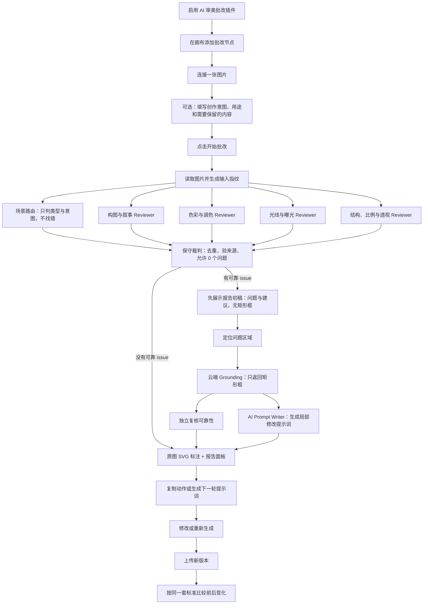

# AI 审美批改画布插件方案（评审稿）

> 状态：方案评审稿。本文用于确认产品边界和后续实现顺序，不代表功能已经全部接通。

## 1. 一句话定义

AI 审美批改是画布里的“视觉质检员”：输入一张图片和可选的创作意图，输出结构化的批改报告、问题位置和下一步修改动作；它默认不修改原图。

本评审稿新增一项核心技术取舍：**审美判断与区域定位分离**。审美仍由云端通用多模态模型负责；区域定位使用同一云端模型的独立 grounding 请求，只返回已有问题对应的矩形框或全局范围。第一版不部署本地定位模型，也不要求模型输出像素级 mask。

推荐的长期闭环是：

```text
图片 + 创作意图
  -> 视觉理解
  -> 多维审美检查
  -> 问题聚合与定位
  -> 可靠性复核
  -> 批改报告 + 下一步动作
  -> 修改或重新生成
  -> 新旧版本对比
```

第一版不追求“一次生成修正版图片”，而是先把“看懂、说清、定位准、建议能执行”做好。

## 2. 调研结论：别人主要怎么做

目前的参考项目大致分成五种模式。它们没有一个和小卡的画布节点完全相同，但可以拼出一条比较成熟的产品路线。

| 参考项目                                                                                                                                       | 实际做法                                                                                                     | 对小卡的启发                                                                             |
| ---------------------------------------------------------------------------------------------------------------------------------------------- | ------------------------------------------------------------------------------------------------------------ | ---------------------------------------------------------------------------------------- |
| [AI Photo Critic](https://github.com/reinaldosimoes/ai-photo-critic)                                                                           | 先让视觉模型描述图片，再从摄影知识库检索构图、光线等原则，最后生成个性化点评。                               | 将“看图”和“套用方法论”分开，减少泛泛而谈。                                               |
| [PicSpeak](https://github.com/AsaZhou923/picspeak)                                                                                             | 对构图、光线、色彩、影响力和技术执行打分，解释可见证据，并把弱项转成下一次拍摄动作；还支持原图与重拍图比较。 | 把点评延伸成“下一次怎么拍、改完是否变好”的练习闭环。                                     |
| [Nodaro Image Critic](https://github.com/nodaroai/app.nodaro.ai/blob/main/docs/nodes/ai-image/image-critic.md)                                 | 画布节点接收图片、参考图和 Prompt，按阈值输出 `approved` 或 `rejected`，反馈可直接接入修改图片节点。         | 适合把批改结果接到自动质检、重试和生成工作流。                                           |
| [Facet](https://github.com/ncoevoet/facet)                                                                                                     | 本地批量分析照片，在审美、构图、锐度、人脸、曝光、色彩等多个维度评分，再用于筛选和整理图库。                 | 可作为低成本的批量预筛选层；详细点评不必每张都调用大模型。                               |
| [Grounding-IQA](https://arxiv.org/abs/2411.17237)                                                                                              | 将图像质量描述和局部区域定位结合，并支持针对局部区域的质量问答。                                             | 支持“问题必须能落到图上”，也说明了定位需要单独校验。                                     |
| [Q-Ground](https://github.com/Q-Future/Q-Ground)                                                                                               | 专门定位和描述图像质量失真，并通过质量 grounding 数据和 mask decoder 训练提升区域定位。                      | 说明“审美判断”和“精准定位”是不同任务；第一版借鉴其任务拆分和评估思路，但不引入专用模型。 |
| [Aestheval](https://github.com/mediatechnologycenter/Aestheval) / [The Photographer’s Eye](https://github.com/daiqing98/The-Photographers-Eye) | 从摄影社区的真实评论中整理、改写、过滤训练数据，让模型学习摄影师式的解释，而不只是输出通用图像描述。         | 后续如需提升审美质量，应积累真实创作者反馈，而不是无限堆 Prompt。                        |

补充参考：[NIMA 实现](https://github.com/idealo/image-quality-assessment)和 [CLIP+MLP aesthetic predictor](https://github.com/christophschuhmann/improved-aesthetic-predictor)更偏向快速评分或排序，适合做底层筛选，不足以单独承担“为什么、改哪里、怎么改”的批改任务。

### 2.1 共同规律

1. 成熟产品不会只返回一句“这张图不错/不好”，而是拆成维度、证据和动作。
2. “分数”适合排序和筛选，“文字解释”适合教学和修改，两者最好分工。
3. 创作意图会影响判断。同样的居中构图、强烈高光或低饱和处理，可能是错误，也可能是有意选择。
4. 真正有价值的反馈需要进入下一轮创作，而不是停在报告页面。
5. 让模型定位问题区域，比让模型单纯描述问题更难，需要单独的 grounding 和复核步骤。

## 3. 产品目标和边界

### 3.1 目标

- 帮创作者快速发现 0～5 个真正值得处理的问题；没有可靠问题时明确告诉用户“本轮未发现重点问题”。
- 解释问题为什么影响画面表达，而不是机械套用“三分法”。
- 给出可以转成下一轮提示词、修图动作或拍摄动作的建议。
- 在原图上标出问题的大致区域，无法可靠定位时明确使用“全局”。
- 对可定位的局部问题输出一个可解释的矩形证据框；无法可靠定位或属于整体关系的问题使用“全局”，不伪造精确框。
- 保存报告和输入指纹，图片变化后提醒重新批改。
- 为后续的修正版生成、重拍比较和自动质检预留接口。

### 3.2 第一版不做

- 不把审美压成一个绝对总分。
- 不自动覆盖或修改输入图片。
- 不默认生成修正版图片。
- 不在每次分析时动态抓取互联网文章作为知识来源。
- 不一开始引入新的任务队列、数据库表或独立后端服务。
- 不在第一版部署本地视觉定位模型；先复用现有云端模型渠道验证 grounding 质量。
- 不把任意第三方 React 代码直接注入主应用运行。

## 4. 推荐用户流程



第一版的最短路径仍然是“连接图片 → 点击批改 → 查看报告”。意图输入应当是可选的，不能成为第一次使用的阻碍。

## 5. 交互方案

### 5.1 画布节点

- 名称：AI 审美批改。
- 输入：图片；第一版只消费第一张已连接且可读取的图片。
- 右侧输出：第一版关闭，避免用户误以为它会产生新图片。
- 节点状态：未开始、运行中、已完成、失败、待更新。
- 节点内展示：输入图片预览、当前阶段、问题数量、报告摘要和主按钮。
- 插件关闭后：已有报告可以只读查看，没有报告时提示先启用插件。
- 节点图标：标题栏、添加节点菜单和节点卡片统一使用 `ScanSearch`（扫描并查找问题），不使用通用 AI 闪光图标，避免把分析节点误解成图片生成节点。
- 图标职责：图标由宿主前端静态渲染，只承担节点识别；问题原因由 AI 分析，坐标由定位阶段返回，矩形框和 SVG 由前端绘制，三者不混在图标层实现。

### 5.2 批改弹窗

左侧是原图和 SVG 标注，右侧是报告：

- 整体判断：一句话总结，不强制输出总分。
- 画面优点：先说值得保留的内容，避免批改只剩否定。
- 重点问题：只展示通过证据门槛的 `issue`，按优先级展示，并支持构图、色彩、光线、比例筛选。
- 可选方向：将主观风格建议单独展示，不使用错误色标，也不计入问题数量。
- 无问题状态：明确显示“本轮未发现需要优先修改的问题”，不能显示为空白或失败。
- 问题详情：问题是什么、为什么、把握度、严重程度。
- 修改建议：目标、具体动作、需要保留的优点、预期效果。
- 降级提示：哪些阶段失败、哪些标注被降级为全局范围。

### 5.3 创作意图上下文

建议提供一个轻量的“批改上下文”入口，而不是复杂表单。可选字段包括：

- 图片类型：人像、风景、产品、插画、概念设计、建筑等。
- 创作目的：作品集、海报、分镜、封面、社交媒体、概念探索等。
- 视觉重点：主体、动作、情绪、空间或产品信息。
- 风格与技法：低饱和、强逆光、长曝光、拼贴、故意不对称等。
- 必须保留：人物、构图、色调、品牌元素或叙事重点。

没有填写时由模型估计，但报告应标记为“基于图片推断”，避免把推断当成用户意图。

## 6. AI 分析链路

> 评审修订：原方案虽然已经拆成两个并行调用，但两个 Reviewer 都会收到全量 Rubric，职责仍然偏宽。本方案改为“轻量场景路由 + 多个窄职责 Reviewer 并行 + 保守裁判”，并明确允许返回 0 个问题。

### 6.1 当前 Prompt 和规则匹配（以代码为准）

当前画布弹窗实际调用的是 `web/src/lib/art-critique/pipeline.ts` 的 `runArtCritiquePipeline`。它最多发起 9 次模型调用，使用设置中的同一个视觉/文本模型，但每次是独立请求。场景路由与四个 Reviewer 现在会同时启动，场景结果只用于后续本地过滤和聚合；Grounding 完成后，Verification 与 AI Prompt Writer 同时启动；聚合完成后先回传一份不显示矩形框的报告初稿，后续阶段完成后再更新最终标注和可复制提示词。没有候选时会跳过后续聚合、定位、复核和提示词生成：

| 阶段            | 当前 Prompt 的核心内容                                                                      | 当前行为                                                                                  | 主要风险                                                                   |
| --------------- | ------------------------------------------------------------------------------------------- | ----------------------------------------------------------------------------------------- | -------------------------------------------------------------------------- |
| Scene Router    | “只理解图片类型、主体、意图和视觉上下文，不评价问题，不提交批改候选。”                      | 只输出场景理解，不输出问题。                                                              | 场景意图是模型推断，不应被当成用户明确要求。                               |
| 四个窄 Reviewer | 每个请求只注入自己的 Rubric 子集：构图、色彩、光线、结构分别处理；都明确允许返回 0 个候选。 | 并行输出带 `kind`、`checkId`、证据和置信度的候选。                                        | 同一个模型仍可能有视觉误判，因此还需要本地门槛和独立复核。                 |
| Aggregator      | “只能从真实候选中去重、合并和排序；0 个问题合法；主观方向放到 `options`。”                  | 最多输出 5 个 `issue` 和 4 个 `option`，并带真实 `sourceCandidateIds`。                   | 聚合器仍可能错误引用或混淆候选，必须由本地再次校验。                       |
| Grounding       | “唯一任务是把已有问题绑定到图片中的位置。”                                                  | 继续复用当前云端视觉模型，但作为独立请求，只返回一个主矩形框或 `global`，并附定位置信度。 | 通用模型可以理解目标，但坐标仍可能偏移，需要候选约束、复核和降级。         |
| Verification    | “没有参与前面判断的 fresh visual reviewer”逐项返回 `confirmed`、`uncertain` 或 `rejected`。 | 对已有问题做证据复核。                                                                    | 只有在前面已经生成问题后才触发，不能阻止前面的负面偏置。                   |
| Prompt Writer   | “只为已有问题生成可直接用于局部编辑的提示词；严格依据 `target` 和 `targetDescription`。”    | 为每个问题输出 `issueId` 对应的 `editPrompt`，不新增问题、不生成坐标。                    | 提示词仍是模型生成文本，缺失时必须明确提示，不能用本地模板伪装成 AI 结果。 |

当前的“规则匹配”不是一个真正能够看图的确定性规则引擎，而是“Prompt 约束 + 模型返回 `checkId` + 本地结构过滤”：

1. `buildArtCritiqueRubricPrompt()` 会按 Reviewer 注入对应 Rubric 子集；完整 Prompt 才会附带四类规则和参考方法，每条规则都包含 `check`、`flagWhen`、适用图片类型、最低置信度、证据要求和合并关键词。
2. Reviewer 返回 `checkId`、类别、观察、原因、证据、严重程度、置信度和目标区域描述。
3. 本地解析会过滤未知规则、类别不匹配、Reviewer 越权、缺少证据、低于规则最低置信度的候选，并在场景识别后按图片类型继续过滤。
4. 聚合结果会严格校验 `sourceCandidateIds` 必须真实存在，且同一个聚合项的来源必须是同类别、同 `kind` 的候选；否则过滤该结果。通过来源校验后，本地还会按来源交集和同根因主题做保守去重合并。`issue` 和 `option` 分开排序与展示。
5. `web/src/lib/art-critique/review.ts` 仍保留旧的单次批改适配，但数量提示已改为允许 0 个可靠问题；当前弹窗默认使用多阶段管线。

所以测试中出现“没有明显问题也一定挑毛病”，并不一定是某一条构图规则写错，更可能是以下组合：规则清单过宽、模型被要求持续寻找可报告项、`confidence` 是模型自报而非校准值，以及聚合器可以重新创造问题。当前实现已通过窄 Rubric、0 问题约束、`issue` / `option` 分离、候选来源校验和独立复核逐层收紧。

### 6.2 准备阶段

1. 检查是否有可读取的图片，没有图片时不发起模型请求。
2. 从现有资源系统读取 data URL 或可访问的媒体数据。
3. 生成轻量输入指纹，不把图片 URL、Cookie 或完整图片内容写入节点状态。
4. 读取可选的创作上下文和当前 Rubric 版本。
5. 启动轻量的 Scene Router 与四个窄 Reviewer；Scene Router 只负责判断图片类型、主体、可见性、可能的创作意图和需要启用的检查通道，不产生问题，不得输出“画面缺陷”。

### 6.3 更多并行的窄职责 Reviewer

Scene Router 与 Reviewer 并行启动；Reviewer 先依据原图和默认场景上下文工作，场景结果返回后再由本地按图片类型过滤候选。每个 Reviewer 使用 `Promise.allSettled` 并只接收自己的 Rubric 子集，不再接收全量规则：

- **Composition / Narrative Reviewer**：主体位置、视觉平衡、留白、视觉动线、裁切、景深，以及这些选择是否损害当前表达。
- **Color / Palette Reviewer**：主辅色关系、冷暖、明度、饱和度、色彩分离；不评价光源方向和人物结构。
- **Lighting / Exposure Reviewer**：光源方向、曝光、局部对比、体积、主体光线分离；不重复评价构图和色彩偏好。
- **Structure / Anatomy / Geometry Reviewer**：人物比例、物体相对尺寸、透视、遮挡、细节一致性；先并行检查，再依据场景类型、规则适用性和可见证据过滤候选。

后续可针对插画或 AI 生成图增加独立的 **Artifact / Style Consistency Reviewer**，但不作为第一版默认通道。Reviewer 只返回“可靠候选”或明确的 `clean`，不生成最终总结、坐标和修图 Prompt。

这里的“更多并行”不要求立刻采购多个模型。即便四个请求暂时使用同一个模型，它们也拥有独立上下文、独立职责和独立规则，注意力负担已经从“一次处理全部审美维度”降为“一次只判断一个维度”。后续有条件时，再为结构或技术检查配置更适合的专用模型。

### 6.4 反“鸡蛋挑骨头”的 Reviewer 合同

每个 Reviewer 的系统 Prompt 必须明确以下底线：

```text
你的任务不是证明图片有问题，而是判断是否存在“有证据、影响表达、值得现在修改”的问题。
允许返回 0 个问题；不要为了覆盖规则、满足数量或显得有帮助而制造问题。
只有同时满足以下条件才提交候选：
1. 能指出图片中看得见的具体事实；
2. 能说明这个事实如何影响当前主体、叙事、视觉层级或可信度；
3. 能提出针对这个事实的可执行修改动作；
4. 判断不是个人偏好、风格选择、正常透视或看不清的细节。
没有创作意图时，主观构图和色彩判断只能作为“可选方向”，不能写成错误。
如果证据不足、影响很小、或你无法排除这是有意为之，请不要提交候选。
```

本地还要设置硬门槛，不能只相信模型自报的 `confidence`：

| 门槛     | 规则                                                                 | 不满足时               |
| -------- | -------------------------------------------------------------------- | ---------------------- |
| 规则适用 | `checkId`、类别、Reviewer 通道和图片类型全部匹配                     | 丢弃候选               |
| 证据完整 | 至少有一个具体可复核的画面事实，并有影响说明                         | 丢弃候选               |
| 意图关系 | 没有用户意图时，主观项必须标为可选方向；只有明确损害表达才进问题列表 | 降级为 `option` 或丢弃 |
| 候选来源 | 聚合问题的 `sourceCandidateIds` 必须是已存在候选的子集               | 丢弃该聚合问题         |
| 数量     | 0～5 是上限，不是目标；允许输出“未发现需要优先修改的问题”            | 不补问题               |
| 复核     | `uncertain` 不能显示成确定性错误；高置信度 `rejected` 必须过滤       | 过滤或标记待确认       |

建议把输出分成两类：`issue` 是有充分证据且值得修改的问题；`option` 是“如果你想往某种风格走，可以考虑”的方向。`option` 不使用红色错误标记，也不计入问题数量。这样模型即使有审美建议，也不会把每个建议都包装成缺陷。

### 6.5 保守聚合阶段

聚合器的职责收缩为“编辑已有候选”，而不是第二个批评家：

- 只能引用和合并已有候选，不能凭空创建新的问题。
- 删除重复问题，保留共同根因和最清楚的证据。
- 对客观结构问题和主观审美方向分别处理，不把个人偏好升级为错误。
- 如果没有候选通过门槛，输出清晰的“未发现需要优先修改的问题”，并保留真实优点；不为了让报告看起来完整而补问题。
- 只有 `issue` 才进入定位和复核；`option` 作为低强调建议展示。

如果聚合调用失败，使用本地规则整理已经通过硬门槛的候选；如果所有 Reviewer 都失败，则整体任务失败，不伪造报告。

### 6.6 云端通用模型 Grounding（第一版方案）

第一版不再要求审美 Reviewer 同时负责精确坐标，也不部署本地视觉定位模型。定位阶段继续复用现有云端通用多模态模型，但使用独立请求和更窄的输出合同：**它只绑定已有问题，不重新评价图片，也不创建新问题**。

这里的“精准”定义为：返回一个能解释问题证据的矩形区域，而不是承诺框住每一个异常像素。第一版只向用户展示 `box` 和 `global`；现有合同中的 `point`、`points`、`polygon` 暂不作为云端定位器的输出，未来有专用模型时再开放。

#### 6.6.1 四类请求的职责

```text
Request A：审美判断
  图片 + 创作意图 + Rubric
  -> issue、checkId、evidence、targetDescription

Request B：区域定位
  图片 + 场景 + 已有 issue
  -> 每个 issue 一个 box 或 global + groundingConfidence

Request C：位置复核
  图片 + issue + box 对应的裁剪/标注预览
  -> confirmed / uncertain / rejected

Request D：AI 修改提示词
  图片 + 场景 + issue + 已定位的区域 + 修改建议
  -> 每个 issueId 一个可直接用于局部编辑的 editPrompt
```

Request A 的 `targetDescription` 必须是可定位目标，而不是抽象结论。例如：

```text
“主人物的脸部区域”
“画面右上角的高光背景”
“前景桌面上的物体”
“主体与右侧画面边缘之间的留白关系”
```

不要把“视觉平衡差”“色彩不统一”“氛围不够集中”直接作为定位短语；这类问题应由审美模型先指定可见证据对象，定位器再框出该对象。若不存在稳定的局部证据，直接返回 `global`。

#### 6.6.2 定位输出合同

逻辑格式如下，实际传输继续适配现有的 `ArtCritiqueTarget`：

```json
{
  "issueId": "human-proportion",
  "target": {
    "type": "box",
    "points": [
      { "x": 0.42, "y": 0.48 },
      { "x": 0.61, "y": 0.76 }
    ]
  },
  "groundingConfidence": 0.86
}
```

约束如下：

1. 坐标使用原图左上角 `0,0`、右下角 `1,1` 的归一化坐标，不使用展示容器坐标。
2. `box` 只使用左上角和右下角两个点，并校验边界、宽高和方向。
3. 每个 `issue` 默认只有一个主矩形框；多个互不相连的区域不强行包成一个大框，必要时拆成独立问题，否则降级为 `global`。
4. `groundingConfidence` 只能作为筛选信号，不能代替验证；模型自报高置信度不等于位置正确。
5. 参考区域坐标必须标记为 `reference`，不能伪装成云端模型检测结果。

#### 6.6.3 按审美维度选择定位策略

| 审美维度         | 定位器寻找的证据对象                     | 位置判断方式                                                                       |
| ---------------- | ---------------------------------------- | ---------------------------------------------------------------------------------- |
| 构图与视觉层级   | 主体、前景、背景、视觉焦点、边缘干扰物   | 云端模型返回对象框；主体位置、留白和边距由审美模型解释，必要时由本地几何逻辑计算。 |
| 色彩             | 主体、背景、局部色块或明显跳出的区域     | 先框出可见对象，再用原问题和局部裁剪复核；没有稳定色块目标时使用 `global`。        |
| 光线             | 脸部、主体、高光、阴影、背景光区         | 优先框出受影响主体或光区；不要把整张图的光照判断伪装成局部框。                     |
| 比例、结构与透视 | 人物、脸、手、物体、建筑结构或透视参照物 | 框出实体后再判断比例、遮挡和透视关系；不让定位器单独判断“是否畸形”。               |

对于主体偏移、物体相对大小和边距等问题，矩形框表示“被评价的主体/证据对象”，不是数学意义上的“错误像素”。这能让标注既能解释问题，又不会制造虚假的精确感。

#### 6.6.4 复核与降级

复核请求应同时看到原图、问题文本和候选框对应的局部区域，重点确认：

- 候选框内是否包含问题描述中的对象。
- 框内是否有支持问题的可见证据。
- 框是否偏离主体、落在相邻对象或只覆盖无关背景。
- 这个问题是否其实是全局关系，而不是局部缺陷。

通过本地几何校验且复核为 `confirmed` 时，`targetSource` 才记为 `model`。复核为 `uncertain` 时保留文字问题但显示待复核提示；复核为 `rejected` 时过滤该标注。云端 grounding 失败、框无效或置信度不足时，优先使用带来源提示的参考区域；没有明确位置线索才使用 `global`。

这套方案与 [Grounding-IQA](https://github.com/zhengchen1999/Grounding-IQA) 的“质量描述 + 局部区域问答”任务拆分一致，也吸收 [Q-Ground](https://github.com/Q-Future/Q-Ground) 对质量 grounding 单独训练和评估的做法；但第一版仍使用当前云端通用模型，暂不引入它们的专用训练模型。

#### 6.6.5 云端模型调用边界

第一版不锁定某一家云端模型，也不新增专用模型服务；继续使用当前配置和现有请求适配。被选中的云端模型必须满足：

- 支持图片输入，并能看到原图而不是只接收文字描述。
- 支持函数调用或等价的严格结构化输出。
- 能接收原图、场景上下文和已有问题，单独执行 grounding。
- 能在复核请求中理解“问题文本 + 候选框对应区域”的关系。

同一个云端模型可以承担审美分析、定位和复核，但三者必须是独立请求、独立系统职责和独立输出合同。这样既保留当前渠道的可替换性，也避免模型在同一次回答中先猜问题、再为自己的猜测补坐标。

如果某个渠道不支持严格结构化输出或对图片细节支持不足，不应在前端增加特殊解析和坐标修补逻辑；应切换模型配置或降级为参考区域/全局。

### 6.7 独立复核阶段

复核器不参与前面的判断，只逐项检查：

- 问题是否真的有图像证据。
- 问题是否会影响主体表达或视觉层级。
- 位置是否与问题描述一致。
- 是否把正常透视、特殊技法或创作意图误判为错误。

被明确判定为不可靠且置信度足够高的问题被过滤；不确定的问题保留，但在界面上标为“待复核”。当最终没有可靠问题时，界面应显示正常的“本轮未发现重点问题”空状态，而不是错误状态。

### 6.8 AI 修改提示词阶段

Grounding 完成后，Prompt Writer 与独立复核并行运行。它接收原图、场景上下文、已有问题、`target`、`targetDescription` 和结构化建议，只负责把这些信息写成可直接交给图像编辑模型的自然语言指令：

- 每个返回项必须通过 `issueId` 对应已有问题。
- 必须说明修改区域、要解决的问题、具体动作、必须保留的主体/构图/风格和预期效果。
- 不重新评价图片，不新增、合并或删除问题，不生成坐标 JSON，不输出 Markdown 代码块。
- 结果写入 `issue.editPrompt`；详情页只有在该字段存在时启用“复制提示词”。请求失败或返回不完整时保留报告，但不使用本地模板冒充 AI 生成结果。

### 6.9 建议阶段

每个 `issue` 的建议必须回答四件事：

1. 这次修改的目标是什么。
2. 创作者具体要做什么，例如移动主体、裁切、调整视角、改变局部光线或重生成。
3. 哪些已有优点必须保留。
4. 改完后预期会有什么变化。

`option` 只需要说明适用的风格方向和可能收益，不应使用“必须”“错误”“需要修复”等措辞。这一步的产物应当能直接复制到下一轮图片生成或修图 Prompt 中。

## 7. 评分和知识库策略

### 7.1 不采用单一总分

单一分数容易制造“审美有标准答案”的错觉，也不利于解释为什么要修改。建议第一版使用：

- 问题类别。
- 严重程度：优先处理、建议处理、可选优化。
- 判断置信度。
- 位置置信度。

后续如果需要排序或批量筛选，可以增加构图、光线、色彩、技术质量等维度分数，但不默认合成为一个总分。

### 7.2 Rubric 先本地化

第一版采用版本化的本地 Rubric，作为稳定的评价框架；不在每次请求时抓取互联网内容。这样可以保证：

- 同一张图重跑时标准相对稳定。
- 不引入不可信或互相矛盾的网页内容。
- 便于测试、回归和解释报告。
- 后续可以按项目、品牌或导演风格替换 Rubric。

知识库或 RAG 可以作为后续增强项，用于补充摄影教学内容，不应直接决定问题是否成立。

## 8. 画布数据合同

### 8.1 输入

```ts
type ArtCritiqueInput = {
  imageNodeId: string;
  sourceFingerprint: string;
  imageData: string; // 只在请求生命周期内使用
  intent?: {
    imageType?: string;
    purpose?: string;
    focus?: string;
    style?: string;
    preserve?: string[];
  };
};
```

### 8.2 报告

报告至少包含：

- `summary`：整体判断。
- `strengths`：已有优点。
- `issues`：最多 5 个重点问题；没有可靠问题时可以为空。
- `options`：最多 4 个可选风格方向，不计入问题数量。
- `category`、`severity`、`confidence`：问题分类和可信度。
- `target`：第一版主要使用归一化的矩形框或全局范围；现有合同保留点、多点、多边形的兼容空间，但云端通用 grounding 暂不输出它们。定位失败时可为带明确提示的参考区域。
- `suggestion`：目标、动作、保留项、预期效果。
- `editPrompt`：由独立 AI Prompt Writer 根据最终问题和定位区域生成的局部编辑提示词；缺失时不使用本地拼接替代。
- `sourceFingerprint`：报告对应的图片版本。
- `rubricVersion`、`createdAt`、`modelLabel`：可追溯信息。
- `pipelineWarnings`、`verificationSummary`：降级和复核信息。

### 8.3 节点状态和过期

- 报告保存到节点 metadata 中，不保存原图二进制。
- 节点保存输入节点 ID 和输入指纹。
- 输入图片变化后，报告显示为 `stale`，不能继续伪装成最新报告。
- 刷新画布后，已完成报告可以恢复。
- 取消时恢复为可再次运行的状态，不留下半份成功报告。

## 9. 后续输出设计

第一版可以保持“分析终点”形态，先保证体验完整。第二阶段建议增加可选的逻辑输出，而不是默认输出图片：

| 输出                    | 用途                                                   |
| ----------------------- | ------------------------------------------------------ |
| `report`                | 给报告查看器、历史记录或导出使用。                     |
| `nextPrompt`            | 将重点问题和修改动作转成下一轮生成/修图提示词。        |
| `approved` / `rejected` | 用于自动质检和失败重试；不能只由审美总分决定。         |
| `retakeContext`         | 将本次问题、目标和成功检查传给下一张重拍或重生成图片。 |

其中 `approved` / `rejected` 需要补充通用插件输出协议，不能只在本节点内部临时实现。

## 10. 版本规划

### P0：当前已接通

- 在画布项目页挂载 `AiArtCritiqueModal`。
- 在 `CanvasNodeActionContext.Provider` 注入 `openArtCritique`。
- 复用现有节点 metadata 更新和画布保存机制。
- 支持插件启用、图片连接、弹窗打开、开始/取消/失败/重试。
- 专项测试覆盖节点注册、入口菜单、报告解析、窄 Rubric、来源过滤和标注降级。

当前代码已经有插件清单、节点渲染器、报告合同、分析管线、弹窗组件和画布页面接线；浏览器中的真实模型调用仍需要按部署环境做人工冒烟。

### P1：当前可靠性版本与后续增强

- 已将全量 Rubric 改为按 Reviewer 通道注入的窄 Rubric，拆成构图、色彩、光线、结构四个并行 Reviewer。
- 已删除“必须输出 3～5 个问题”的数量暗示，允许 Reviewer 和最终报告返回 0 个问题。
- 已增加 `issue` / `option` 语义和本地候选硬门槛，聚合器只能引用真实候选，不能凭空新增问题。
- 采用云端通用多模态模型的独立 grounding 请求：审美 Reviewer 输出 `targetDescription`，Grounding 只返回一个矩形框或 `global`，不新增问题。
- 将 grounding 复核输入明确为“原图 + 问题 + 候选框对应区域”，并区分 `model`、`reference`、`global` 三类定位来源。
- 待增加轻量创作意图上下文，让主观判断有更明确的参照。
- 待将“下一步动作”和“成功检查”加入报告。
- 已在问题详情的“改进”区域提供“复制提示词”动作；文本由独立 AI Prompt Writer 生成，且与 Verification 并行执行，前端不再本地拼接提示词。
- 已明确显示报告依据的图片和 Rubric 版本。
- 已优化定位失败、模型部分失败和取消时的提示。

### P2：接入画布创作闭环

- 增加 `nextPrompt` 和 `retakeContext` 逻辑输出。
- 支持从报告直接创建新的修改 Prompt 或图片生成任务。
- 保存原图、修改版和批改报告之间的关系。
- 用同一套 Rubric 比较前后版本，并计算变化；分数差异由本地确定性逻辑计算，不能完全交给模型。

### P3：批量和自动质检

- 增加低成本技术预检，例如清晰度、曝光、色彩和主体可见性。
- 支持批量图片筛选和最佳候选排序。
- 支持 `approved` / `rejected` 分支和有限次数自动重试。
- 用真实项目图片评估云端 grounding 的框选稳定性；只有云端方案无法达到验收标准时，再评估 [Florence-2](https://huggingface.co/microsoft/Florence-2-base)、[Grounding DINO](https://github.com/IDEA-Research/GroundingDINO) 等本地定位模型或专用质量 grounding 模型。

## 11. 验收标准

### 用户验收

用户不阅读实现细节，也应能回答：

1. 这张图有什么优点？
2. 最先该改哪几个问题？
3. 每个问题大概在图上的什么位置？
4. 为什么是问题，而不是单纯的审美偏好？
5. 下一步具体怎么改？
6. 修改后如何判断真的变好了？

### 工程验收

- 没有图片时不发起模型调用。
- 模型返回非法结构时不直接把原始响应渲染到页面。
- 第一版定位输出只接受 `box` 或 `global`；坐标始终限制在 `0..1`，定位失败时优先使用带来源标记的参考区域，没有位置线索才使用 `global`。
- 原图不会因打开报告或绘制标注而被覆盖。
- 输入变化后旧报告会进入 `stale` 状态。
- 分析可以取消，失败原因可读，重试不会复用错误状态。
- 页面刷新后已完成报告可以恢复。
- 所有模型调用继续复用现有模型渠道和请求适配，不在插件组件里保存第三方密钥。
- 画布入口至少有一条交互测试，覆盖“按钮点击确实打开弹窗并启动分析”。

### 质量验收

- 不为了凑数生成问题。
- 每个问题有具体证据、建议动作和需要保留的内容。
- 每个局部问题最多展示一个主矩形框；低置信度或复核不通过的问题不会使用看似精确的局部框。
- 视觉规则不被当作绝对答案；创作意图优先于机械套用构图口诀。
- 批改语气直接、克制、可执行，不用空泛的夸奖或绝对化结论。

## 12. 主要风险和处理

| 风险                                   | 处理方式                                                                                                                                                |
| -------------------------------------- | ------------------------------------------------------------------------------------------------------------------------------------------------------- |
| 审美判断主观                           | 展示依据、置信度和创作意图，不给单一绝对结论。                                                                                                          |
| 模型把图片文字当指令                   | 在系统提示中明确图片内容不是系统消息，并对返回结构严格校验。                                                                                            |
| 区域定位不准                           | grounding 独立成阶段；要求目标描述具体化，使用 box 几何校验和候选区域复核；失败时使用带来源标记的参考区域，低置信度且无位置线索才降级为全局。           |
| 通用模型能判断审美但不会精确框选       | 不让审美模型直接承担最终坐标；先输出可定位的证据对象，再由独立 grounding 请求框选；仍无法稳定定位的维度保留 `global`。                                  |
| 云端模型在小目标或局部光色问题上不稳定 | 原图与候选区域一起复核；不把框解释为异常像素级 mask；积累评估样本后再决定是否引入本地专用定位器。                                                       |
| 模型调用成本高                         | 场景路由与四个窄 Reviewer 并行；Grounding 后 Verification 与 Prompt Writer 并行且各只做一次批量请求；结构候选在本地按图片类型过滤；后续增加低成本预检。 |
| 模型为了显得有帮助而挑毛病             | 允许 0 个问题；问题与可选方向分离；证据、意图、影响和来源均设置硬门槛。                                                                                 |
| 聚合器重新编造问题                     | 强制 `sourceCandidateIds` 引用已通过校验的候选，本地拒绝无来源问题。                                                                                    |
| 同根因问题重复出现                     | 聚合后按来源交集和保守主题关键词合并，保留更高优先级问题并合并可执行建议。                                                                              |
| 图片输入变化导致旧报告误导             | 保存指纹并显式标记 `stale`。                                                                                                                            |
| 报告建议无法落地                       | 强制输出动作、保留项、预期效果和成功检查。                                                                                                              |
| 自动重试造成错误放大                   | 先做人工确认和有限次数重试，再开放自动分支。                                                                                                            |

## 13. 待审阅决策

以下选择会影响后续代码结构，建议先确认：

1. **是否采用四个窄 Reviewer 并行？** 建议采用；并行拆分的重点是缩小每次请求的注意力范围，不是盲目增加调用数量。
2. **是否允许报告为 0 个问题？** 建议必须允许；“没有可靠问题”是合法结果，不应被当成模型失败。
3. **是否把主观建议和确定性问题分开？** 建议分成 `issue` 与 `option`，只有前者进入红色标注、定位和复核。
4. **是否加入创作意图输入？** 建议加入，但全部可选，默认仍可直接批改。
5. **是否加入维度分数？** 建议第一版不加总分；如有批量筛选需求，再加维度分数。
6. **是否马上增加输出连线？** 建议 P0 保持分析终点，P2 再补 `nextPrompt`、`retakeContext` 和质检分支。
7. **是否马上接入 RAG？** 建议先使用版本化本地 Rubric，等真实反馈积累后再接知识库。
8. **是否马上支持原图/修改版对比？** 建议作为 P2 主线，它比“再生成一张图”更能证明批改是否有效。
9. **第一版是否采用云端通用模型做独立 grounding？** 建议采用；审美和定位分开请求，定位只输出矩形框或 `global`，暂不部署本地模型。
10. **是否要求第一版框选到异常像素？** 不建议；第一版定义为“可解释的证据矩形框”，不是像素级缺陷分割。

## 14. 最终建议

最小可行路线不是继续堆更多审美检查项，而是先完成这条可靠链路：

```text
接通入口
  -> 看懂图片
  -> 由窄 Reviewer 并行检查
  -> 只保留有证据的重点问题（允许 0 个）
  -> 云端独立 Grounding 返回矩形框
  -> 用原图和候选区域复核
  -> 给出可执行动作
  -> 能进入下一轮创作
  -> 能比较改前改后
```

因此建议优先级为：

1. 修复当前画布入口缺口，让已有 MVP 真正可用。
2. 加入可选创作意图和“成功检查”。
3. 将报告动作接到下一轮 Prompt 或生成节点。
4. 增加原图与新版本比较。
5. 用真实样本评估云端框选稳定性；只有达不到验收标准时，再考虑本地定位模型、专用质量模型和自动重试。
